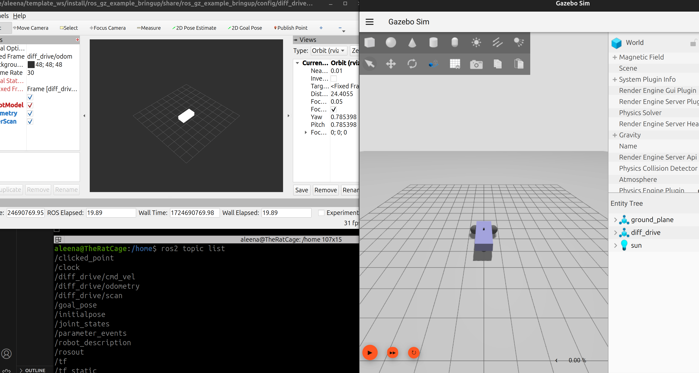

# ROS Gazebo Example Bringup

This package is part of the ROS-Gazebo project template and is responsible for launching the Gazebo simulation environment, setting up ROS 2 nodes, and bridging communication between Gazebo and ROS 2.

## Overview

The primary goal of this package is to simulate a differential drive robot equipped with a camera sensor in Gazebo and visualize the camera feed in RViz. The package includes a launch file that sets up the simulation, the necessary ROS 2 nodes, and bridges topics between Gazebo and ROS 2.

## Files

- **`launch/diff_drive.launch.py`:** This is the main launch file that:
  - Launches the Gazebo simulation with the differential drive robot and attached camera.
  - Starts the ROS 2 `robot_state_publisher` to publish the robot's state.
  - Bridges the camera topic between Gazebo and ROS 2 using `ros_gz_bridge`.
  - Optionally launches RViz for visualizing the robot and camera feed.

- **`config/diff_drive.rviz`:** This file contains the RViz configuration for visualizing the robot and the camera feed.

- **`config/ros_gz_example_bridge.yaml`:** The configuration file for `ros_gz_bridge`, which defines the specific topics to be bridged between Gazebo and ROS 2.

## Setup Instructions

### Prerequisites

- ROS 2 Jazzy
- Gazebo Harmonic
- `ros_gz_bridge` package

### Launching the Simulation

To launch the differential drive robot with the attached camera in Gazebo and visualize it in RViz, run the following command:

```bash
ros2 launch ros_gz_example_bringup diff_drive.launch.py



